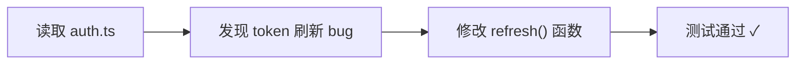

# 代码审查 + 学习差距分析

> 日期：2026-07-17
> 项目：StructFocus 上下文中间层
> 审查范围：全仓库 packages/context + packages/mcp
> 测试：53 tests 全过（7 文件）

---

## 一、当前代码状态

### 评分：7.8/10（较上次 7.5 升）

用户在 7/16 批评"PointerRegistry 被误删、structuredCompress 是裁剪不是压缩"后，做了大幅修正：

### ✅ 已落地（相比上次学习总结的 P0/P1）

| P0 项 | 状态 | 实现方式 |
|---|---|---|
| **上下文卸载** | ✅ 完整落地 | `ContentStore`：forget/evict/truncate 都写磁盘，`recallFromStore`/`recallByFile` 可逆还原 |
| **PointerRegistry 恢复** | ✅ 以更完整形态回归 | `CapsuleStore` + `ContentStore` 替代了原 PointerRegistry，功能更全（含决策提取、约束检测、已放弃方案追踪） |
| **分层加载 L0/L1/L2** | ⚠️ 部分落地 | 胶囊有 `summaryText`（L0 摘要）和完整 JSON（L2 全文），但缺 L1 概览层；focus 仍是全量加载，没有自动降级 |

| P1 项 | 状态 | 实现方式 |
|---|---|---|
| **LLM 自主记忆管理** | ✅ 已落地 | MCP 暴露 18 个工具，LLM 可主动 focus/forget/recall/pack/expand |
| **守护轨质询** | ✅ 独有差异化 | `runInquiry`：冲突检测/缺口检测/一致性检测，竞品都没有 |
| **知识胶囊** | ✅ 比腾讯 refs/*.md 更完整 | 含决策链路、约束、已放弃方案、自动推送规则 |

### 🔴 Bug

1. **`forget:noise` 实现 bug**：当 `e.source` 为 undefined 时，跳过了该条目而非用其他方式清理。`forgetSource` 按 source 匹配，但 observation 类型条目通常没有 source。
   - 位置：`mcp/src/index.ts` forget:noise case
   - 修复：应直接对匹配条目执行 evict+store，而非依赖 `forgetFile(source)`

2. **`summarize:recent` 实现不完整**：`steps` 参数被接收但逻辑是取最后 N 个条目做 `compressEntries`，没有真正按"步"语义压缩（一个 step 可能含多条 entry）。
   - 位置：`mcp/src/index.ts` summarize:recent case

3. **`summarize:conversation` 同样**：`sinceStep` 用作数组索引，但 entry 数组索引 ≠ step 编号。
   - 位置：`mcp/src/index.ts` summarize:conversation case

### ⚠️ 缺失/短板

1. **L1 概览层缺失**：胶囊有 L0（summaryText ~100 tokens）和 L2（完整 JSON），但缺中间层。用户说的"架构压缩，让 LLM 自己找要看到什么"需要 L1：结构化大纲（文件列表 + 符号列表 + 决策一句话），约 500-1000 tokens。LLM 看到 L0 提示后，先 expand 到 L1 大纲，再决定是否要 L2 全文。

2. **focus 仍是全量加载**：`focusFile` 直接读全文 + 提取符号，没有 L0/L1/L2 分级。预算紧张时应自动降级到 L1（符号大纲）而非全量加载。

3. **`structuredCompress` 定位模糊**：它做的是锚点提取（[目标]/[状态]/[动作+结果]等），但名字叫"compress"。按用户"架构压缩"的定义，它应该是生成指针提示而非内容替换。当前 `packSubtask` 才是真正的架构压缩——打包原文 + 留指针。`structuredCompress` 退化为锚点提取器可以，但应改名或明确文档。

4. **新模块测试覆盖良好**：24 个新测试覆盖 ContentStore/CapsuleStore/runInquiry/packSubtask/可逆操作——上次报告的"新模块零测试"问题已修复。

5. **全盘扫描性能隐患仍在**：`ContentStore.loadByFile` 和 `CapsuleStore.findByFile` 仍全盘遍历。条目/胶囊多了会慢。需要内存索引。

6. **ContentStore 已有大量历史数据**：`.structfocus/content-store/entries/` 下有 400+ JSON 文件（之前的测试运行残留）。生产中需要清理策略。

---

## 二、用户核心愿景 vs 当前代码

用户的架构原则（7/17 对话确认）：

> **框架只负责「移出 + 告知」，不负责「选择 + 裁剪」。
> LLM 看到提示后自主判断需要什么 → 拿到的是完整原文，不是框架选的片段。
> 给的是原文，不是摘要，不是裁剪片段。**

对照当前代码：

| 维度 | 用户原则 | 当前代码 | 符合度 |
|---|---|---|---|
| **forget/evict** | 移出 + 告知 + 可还原 | ✅ ContentStore 保存原文，指针留在 entries 中 | ✅ 符合 |
| **packSubtask** | 打包 + 留指针 + LLM 自主展开 | ✅ 胶囊保存完整上下文，留指针 observation，LLM 调 recall:context 展开 | ✅ 符合 |
| **runInquiry 缺口检测** | 告知"有历史上下文" | ✅ 推入胶囊摘要 + recall:context 提示 | ✅ 符合 |
| **runInquiry 冲突检测** | 告知"这个方案被放弃过" | ✅ 推入告警 observation | ✅ 符合 |
| **structuredCompress** | 不应裁剪，应生成指针 | ⚠️ 仍是裁剪（锚点提取），但已退化为层1工具，packSubtask 承担了真正的指针压缩 | ⚠️ 部分符合 |
| **focus** | 应分级加载，先给提示 | ❌ 仍全量加载文件内容 | ❌ 不符合 |
| **recallFromStore** | 给完整原文 | ✅ 从 ContentStore 加载完整内容 | ✅ 符合 |
| **expandCapsule** | 给完整原文 | ✅ 加载完整胶囊 JSON | ✅ 符合 |

**核心结论**：大部分已符合用户原则。两个关键不符合点：
1. `focus` 全量加载（应分级）
2. `structuredCompress` 仍做裁剪（应改为指针生成或明确定位为辅助工具）

---

## 三、学习总结对照——还要学什么

### P0 已落地项

| P0 项 | 落地状态 | 差距 |
|---|---|---|
| 上下文卸载 | ✅ 完整 | 无差距，ContentStore 实现完整 |
| 分层加载 L0/L1/L2 | ⚠️ 部分 | **缺 L1 概览层**；**focus 没有自动降级** |
| PointerRegistry | ✅ 已恢复 | CapsuleStore + ContentStore 更完整 |

### P1 部分落地项

| P1 项 | 落地状态 | 差距 |
|---|---|---|
| Mermaid 任务画布 | ❌ 未落地 | D-Context 仍是线性序列，没有拓扑图 |
| LLM 自主记忆管理 | ✅ 已落地 | MCP 18 个工具，LLM 可主动操作 |
| 目录递归检索 | ❌ 未落地 | Memory 仍是扁平 FTS5 |

### P2 未落地项

| P2 项 | 状态 |
|---|---|
| KV cache 纪律强化 | ⚠️ I-Context 已有 cacheControl，但工具定义冻结未实现 |
| 可视化检索轨迹 | ❌ 未落地 |
| 自动记忆提取（6 类） | ⚠️ 有 `rememberFromContent` 但只提取决策，缺 5 类 |
| 多 Agent 记忆共享 | ❌ 未落地（后续 Phase） |

---

## 四、还要学什么——按优先级

### 🔴 必须做（核心愿景差距）

#### 1. focus 分级加载（学 OpenViking L0/L1/L2）

**当前**：`focusFile` 直接读全文 + 提取符号，一次性塞入上下文。
**应改为**：
- **L0**（~100 tokens）：文件路径 + 大小 + 类型 + 顶层符号列表 → 始终加载
- **L1**（~500-1000 tokens）：结构化大纲（符号 + 签名 + 行号范围）→ focus 时默认加载
- **L2**（完整内容）：仅当 LLM 显式 `recall:context(file)` 时加载

这样 LLM 先看到 L0/L1 提示，自己决定要不要看 L2 全文。符合用户"框架只告知，LLM 自己选"原则。

**工作量**：改 `focusFile` 方法 + `CodeExplorer` 增加分级输出。约 2-3 小时。

#### 2. 胶囊 L1 概览层

**当前**：胶囊有 `summaryText`（L0 ~100 tokens）和完整 JSON（L2），缺中间层。
**应加**：L1 = 文件列表 + 符号列表 + 决策一句话 + 约束一句话，约 500 tokens。
- `expandCapsule` 默认展开到 L1，LLM 看完 L1 后可以再调 `recall:context(id, level="full")` 拿 L2。

**工作量**：`CapsuleStore` 加 `summaryTextL1` 静态方法 + `expandCapsule` 分级。约 1 小时。

### 🟡 应该做（显著提升效果）

#### 3. Mermaid 任务画布（学腾讯）

**当前**：D-Context 历史是线性条目序列，Agent 看不到任务拓扑。
**应做**：当历史层超过阈值（如 20 条），自动生成 Mermaid 摘要替代线性历史：

每个节点关联胶囊 ID，LLM 看到图后可以 `recall:context(node_id)` 下钻。

**工作量**：`builder.ts` 增加 Mermaid 生成函数。约 3-4 小时。

#### 4. structuredCompress 定义修正

**当前**：名叫"compress"但做的是锚点提取（裁剪）。
**应做**：
- 改名为 `extractAnchors` 或在文档明确其定位为"锚点提取辅助工具"
- 真正的架构压缩由 `packSubtask` 承担
- 或者：改造 `structuredCompress` 使其生成指针而非裁剪后的内容

**工作量**：改名 + 文档修正 30 分钟；改造为指针生成 2-3 小时。

#### 5. 自动记忆提取扩展（学 OpenViking/腾讯）

**当前**：`rememberFromContent` 只提取决策模式（5 个正则）。
**应扩展**：6 类记忆自动提取：
- 决策（已有）
- 错误模式（新增）
- 偏好/约束（新增）
- 事件/里程碑（新增）
- 代码模式（新增）
- 实体/概念（新增）

**工作量**：扩展 `rememberFromContent` + MemoryBackend 类型字段。约 2 小时。

### 🟢 可以做（锦上添花）

#### 6. 内存索引解决全盘扫描

`ContentStore.loadByFile` 和 `CapsuleStore.findByFile` 全盘遍历 → 加内存反向索引（source → entryIds）。

**工作量**：1 小时。

#### 7. KV cache 纪律强化（学 Manus）

工具定义固化 + 仅追加不修改 + hash 校验。

**工作量**：2 小时。

#### 8. 目录递归检索（学 OpenViking）

MemoryBackend 增加目录概念，recall 先匹配目录再内搜索。

**工作量**：3-4 小时。

---

## 五、推荐执行顺序

```
第一步（核心愿景）：focus 分级加载 + 胶囊 L1 层
  → 让"框架只告知，LLM 自己选"贯彻到 focus 场景
  → 预计 3-4 小时

第二步（定位修正）：structuredCompress 改名/改造 + bug 修复
  → 让代码语义和架构原则一致
  → 预计 1-2 小时

第三步（效果提升）：Mermaid 任务画布
  → 让 Agent 看到任务拓扑而非线性流水
  → 预计 3-4 小时

第四步（记忆增强）：自动记忆提取 6 类
  → 从扁平 remember 升级为分层记忆
  → 预计 2 小时

第五步（性能+打磨）：内存索引 + KV cache 纪律
  → 性能和工程品质
  → 预计 3 小时
```

---

## 六、评分预测

| 完成步骤后 | 预测评分 |
|---|---|
| 当前 | 7.8 |
| +第一步 focus 分级 | 8.2 |
| +第二步 定位修正+bug | 8.4 |
| +第三步 Mermaid 画布 | 8.7 |
| +第四步 记忆增强 | 8.9 |
| +第五步 性能打磨 | 9.0 |
